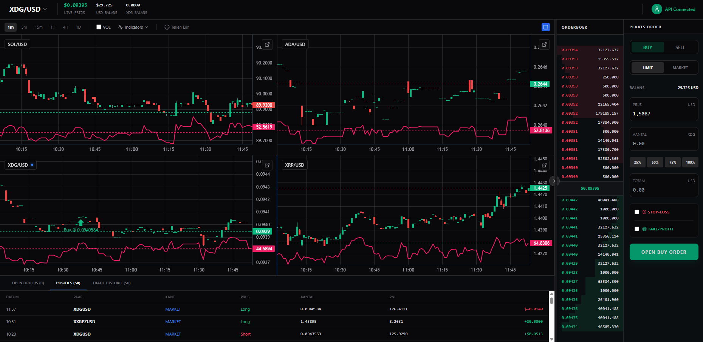

# TradeFazant AI 📈🤖

> An advanced quantitative crypto trading dashboard powered by the **Kraken API** and **Google Gemini AI** for smart, automated market analysis and trading.

Built with React and Node.js, TradeFazant AI bridges the gap between manual trading and algorithmic automation. It offers a sleek interface to manage your portfolio, run automated trading strategies, and leverage AI to make data-driven market decisions.

## ✨ Key Features

* **🤖 Auto Trading Bots (Pro Engine):** Create and manage custom algorithms based on RSI, Bollinger Bands, and SMA trend filters. Includes advanced execution logic like Trailing Buy/Sell, DCA (Dollar Cost Averaging), and strict Risk Management (Stop-Loss/Take-Profit).
* **🧠 Gemini AI Advisor:** An integrated AI assistant that analyzes market conditions (Multi-Timeframe Analysis), optimizes bot parameters (Auto-Tune), and provides real-time, actionable trading advice.
* **⚡ Live Market Data:** Ultra-fast, real-time price feeds and order book depth powered by Kraken WebSockets.
* **📊 Advanced Charting:** Interactive charting powered by TradingView's Lightweight Charts. Includes volume data, popular technical indicators (SMA, BB, RSI, MACD), and visual markers for your active positions and trade history.
* **💼 Portfolio & Order Management:** Monitor your live crypto balances, track your equity curve, and execute Market or Limit orders directly from the dashboard, complete with linked SL/TP targets.
* **🔒 Secure API Handling:** API keys are dynamically routed via headers to a Node.js backend. The backend features a built-in request queue to ensure smooth execution and prevent Kraken API rate-limit errors.

## 🛠️ Tech Stack

* **Frontend:** React, Tailwind CSS, Lucide Icons, Lightweight Charts
* **Backend:** Node.js, Express, Axios, Crypto (for secure Kraken HMAC signatures)
* **APIs:** Kraken (REST & WebSocket), Google Gemini 2.5 Flash API

## 🚀 Installation & Getting Started

Thanks to `concurrently`, you can boot up both the backend and the frontend simultaneously with just one command!

### 1. Installation
Ensure you are in the root directory of the project and install all necessary dependencies:

<<<<<<< HEAD
```bash
# Install root dependencies (including concurrently)
npm install
=======
🏗️ Tech Stack

React + Zustand

Node.js

Kraken API (REST + WebSocket)

▶️ Getting Started
1. Clone the repository
git clone https://github.com/juppejong/new-bot.git
cd new-bot

2. Install dependencies

Install for both backend and frontend:
>>>>>>> d3db3c3808522f9bd19d33d76cab02135176ac5e

# Install backend dependencies
cd crypto-backend
npm install

# Install frontend dependencies
cd ../crypto-dashboard
npm install
2. Run the Platform
Navigate back to the root directory of your project and start the development environment:

Bash
npm run dev
This command will automatically spin up the Node.js backend on port 3001 and launch the Vite/React frontend in your default browser.

3. Configuration
Open the dashboard in your browser.

Click the Settings (gear icon) or the "API Keys" prompt.

Enter your Kraken API Key, Kraken API Secret, and Gemini API Key.

These keys are stored safely in your local storage and are dynamically sent to your backend for secure requests.

⚠️ Disclaimer
Warning: This is experimental software. Automated cryptocurrency trading carries significant financial risk. The creators of this software are not responsible for any financial losses incurred. Always test your algorithms thoroughly and never trade with funds you cannot afford to lose.